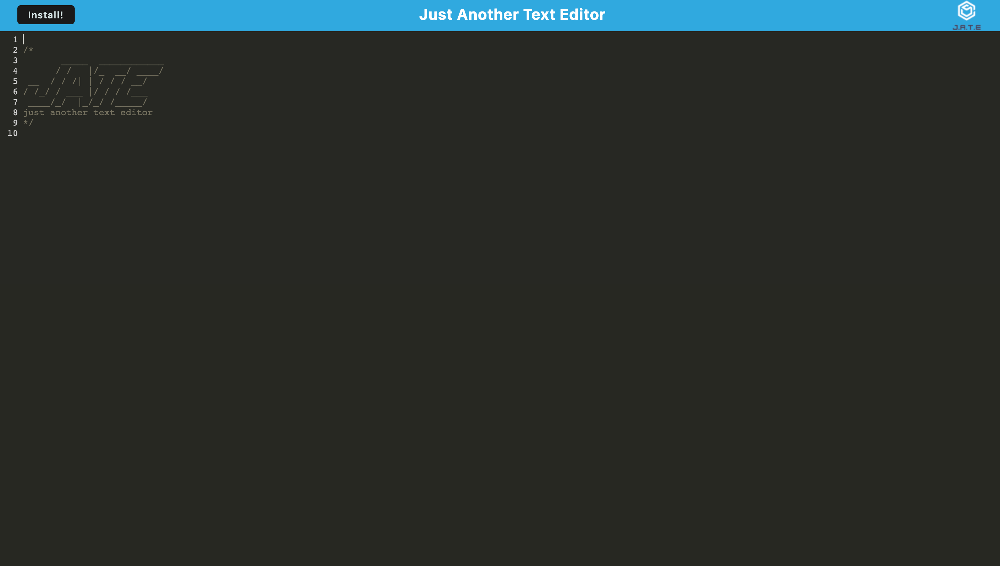

# PWA Text Editor

## Table of Contents
- [Description](#description)
- [Installation](#installation)
- [Usage](#usage)
- [Contributions](#contributions)
- [Test](#test)
- [Contact](#contact)
- [License](#license)

## Description
J.A.T.E is just another text editor. This app focuses on utilizing PWA functions so that users can install and use the website anytime, any place. J.A.T.E uses JavaScript, Node.js, Express, Concurrently, idb, Webpack, and Workbox.

## Installation
Please click the install button on the left-hand side of the page. Users will then be prompted to confirm the instsallation. From there, users can engage with the text editor on or offline as they see fit.

## Usage

See [this link](https://agile-chamber-52429.herokuapp.com/) to view the page.

## Contributions
Sarah Jacobs

## Test
N/A

## Contact
For more information please contact: [sgjacobs14@gmail.com](mailto:sgjacobs14@gmail.com)
Or visit my GitHub page at: [sarahgjacobs]

## License 
    This software is licensed under MIT License
